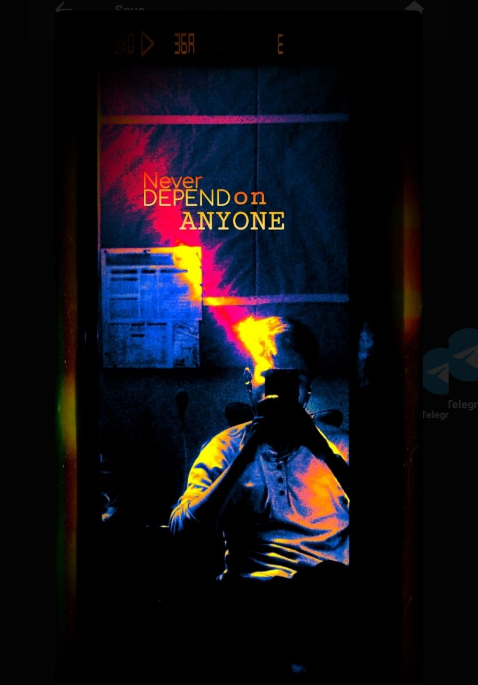
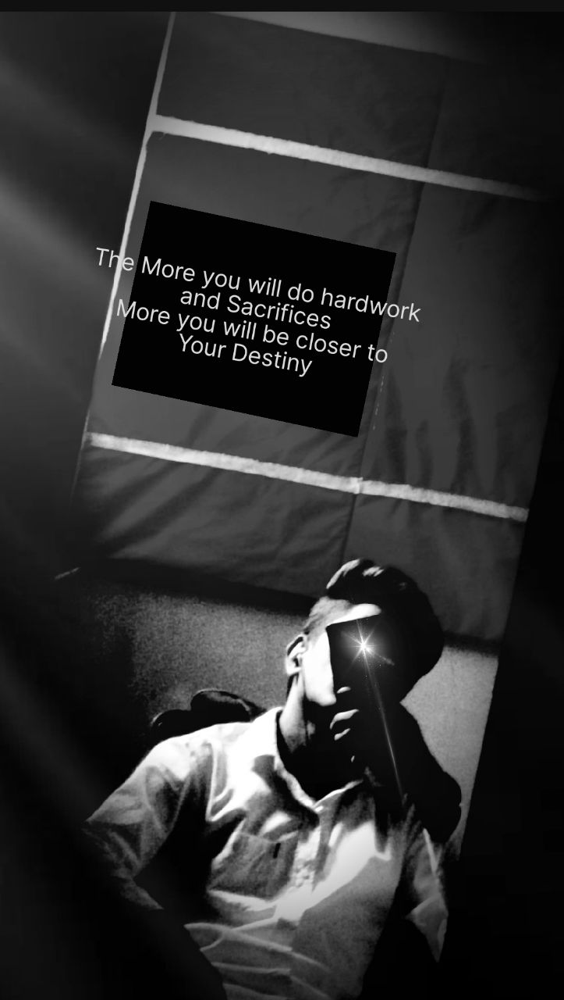

# MY EDITING JOURNEY AND EXPERIENCE

My editing journey started from 2020, lockdwon where I started doing various things for the first time like photography, video making, video editing, photo editing, content writing, scripting, dialogue writing and many more things. Along with technical journey, my music journey also get started. I started learning about casio playing from youtube and try to play piano on the phone through app named [WALK BAND](https://play.google.com/store/apps/details?id=com.gamestar.pianoperfect&hl=en_IN). I learned a few songs and showed to my parents. They got impressed and decided to gift me casio. Then, in September,2020 my parents gifted me a [casio](https://www.flipkart.com/casio-sa-77-km16a-digital-portable-keyboard/p/itmeue6tf6hnqsfg). Casio was a very new thing to me because playing on phone and suddenly on casio, made a quite few problems but I figured it out. Before getting the casio, i already started making videos and uploading on to a channel [[SK MUSIC 3736](https://www.youtube.com/@mahimajindal8623/videos)]. From this, my editing journey started.

I started creating videos, started clicking photos, started how to edited a video, started editing audios and many more things. Through this, I started a connection with technology because all these things created my interest. 

But, unfortunately, I left the channel. Because I was not a good student so I focued myself to studies. But, besides it, I was doing video editing and photography.

So now I wanted to restart it again.

__HERE ARE SOME OF MY EXPERIENCES:__

- __PHOTOS__

____

___

___

___

___

___

___

___

___

___

___

___

___

___

___

___

___

___

___

___

___

___

- __VIDEODS__ 
 
 [VIDEO 1](VIDEO1.mp4)

 ___

 [VIDEO 2](VIDEO2.mp4)
 
 ___
 
 [VIDEO 3](VIDEO3.mp4)
 
 ___
 
 [VIDEO 4](VIDEO4.mp4)
